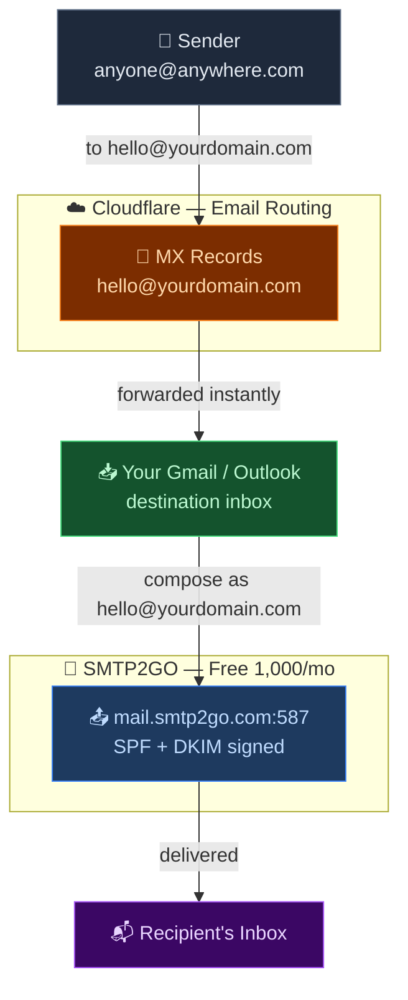
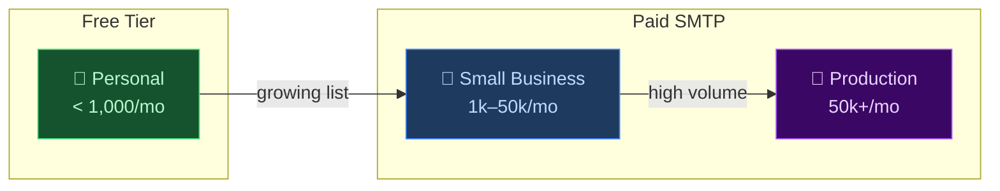

<div align="center">

<!-- Banner SVG -->
<svg xmlns="http://www.w3.org/2000/svg" width="900" height="180" viewBox="0 0 900 180">
  <defs>
    <linearGradient id="bg" x1="0%" y1="0%" x2="100%" y2="100%">
      <stop offset="0%" style="stop-color:#0f1117;stop-opacity:1" />
      <stop offset="50%" style="stop-color:#1a1f2e;stop-opacity:1" />
      <stop offset="100%" style="stop-color:#0f1117;stop-opacity:1" />
    </linearGradient>
    <linearGradient id="accent" x1="0%" y1="0%" x2="100%" y2="0%">
      <stop offset="0%" style="stop-color:#f6821f" />
      <stop offset="100%" style="stop-color:#faad3f" />
    </linearGradient>
    <filter id="glow">
      <feGaussianBlur stdDeviation="3" result="coloredBlur"/>
      <feMerge><feMergeNode in="coloredBlur"/><feMergeNode in="SourceGraphic"/></feMerge>
    </filter>
  </defs>
  <rect width="900" height="180" fill="url(#bg)" rx="12"/>
  <line x1="0" y1="4" x2="900" y2="4" stroke="#f6821f" stroke-width="1" opacity="0.3"/>
  <line x1="0" y1="176" x2="900" y2="176" stroke="#f6821f" stroke-width="1" opacity="0.3"/>
  <g transform="translate(55, 62)" filter="url(#glow)">
    <ellipse cx="40" cy="45" rx="38" ry="20" fill="url(#accent)" opacity="0.9"/>
    <circle cx="22" cy="38" r="16" fill="url(#accent)" opacity="0.9"/>
    <circle cx="42" cy="28" r="22" fill="url(#accent)" opacity="0.9"/>
    <circle cx="62" cy="36" r="16" fill="url(#accent)" opacity="0.9"/>
  </g>
  <g transform="translate(820, 68)">
    <rect x="0" y="0" width="50" height="36" rx="4" fill="none" stroke="#4ade80" stroke-width="2" opacity="0.8"/>
    <polyline points="0,0 25,20 50,0" fill="none" stroke="#4ade80" stroke-width="2" opacity="0.8"/>
  </g>
  <text x="450" y="72" font-family="'Segoe UI', sans-serif" font-size="28" font-weight="800" fill="white" text-anchor="middle" letter-spacing="1">Free Custom Domain Email</text>
  <text x="450" y="108" font-family="'Segoe UI', sans-serif" font-size="15" fill="url(#accent)" text-anchor="middle" letter-spacing="3" font-weight="600">CLOUDFLARE EMAIL ROUTING · SMTP2GO</text>
  <text x="450" y="148" font-family="'Segoe UI', sans-serif" font-size="13" fill="#94a3b8" text-anchor="middle">Send &amp; receive from yourname@yourdomain.com — no paid hosting, no catch</text>
</svg>

<br/>


</div>

---

## 📬 What You'll Build

A fully working `yourname@yourdomain.com` email address — receive in Gmail/Outlook, send from Gmail/Outlook — using only **free** services. No hosting required.

| Service | Role | Cost |
|---|---|---|
|  **Cloudflare** | DNS + inbound email forwarding | Free forever |
|  **SMTP2GO** | Outbound sending via SMTP | Free (1,000/mo · 200/day) |
|  **Gmail** /  **Outlook** | Your actual inbox | Your existing account |

### 🗺️ Architecture



---

## 🧭 Prerequisites

- [ ] A domain you own —  [GoDaddy](https://godaddy.com),  [Namecheap](https://namecheap.com), or any registrar
- [ ] A  [Cloudflare account](https://cloudflare.com) — free
- [ ] An  [SMTP2GO account](https://app.smtp2go.com) — free
- [ ] A  Gmail or  Outlook inbox to forward into

That's it. No server. No hosting. No credit card.

---

## ⚠️ Free Plan Limits

Know these before you start:

| |  Cloudflare Email Routing |  SMTP2GO Free |
|---|---|---|
| **Inbound (receiving)** | ✅ Unlimited | — |
| **Outbound (sending)** | — | 1,000 emails/month |
| **Daily send cap** | — | 200 emails/day |
| **Custom addresses** | ✅ Unlimited | — |
| **Catch-all rule** | ✅ Yes | — |
| **SMTP credentials** | — | 1 user |
| **Cost** | 🆓 Free forever | 🆓 Free forever |

> 💬 **Is this enough?** For personal use, newsletters to a small list, contact forms, or side projects — yes, easily. If you need to send more, [SMTP2GO paid plans](https://www.smtp2go.com/pricing/) start at $15/month for 50,000 emails.

### 📈 Scaling Path

If you outgrow the free tier, here's how to scale — **no architecture changes needed**, just swap the SMTP provider:



| Stage | Volume | Recommended Service | Est. Cost |
|---|---|---|---|
| 🌱 **Personal** | < 1,000/mo |  SMTP2GO Free ← *you are here* | $0 |
| 📬 **Growing** | up to 10,000/mo |  [SMTP2GO Starter](https://www.smtp2go.com/pricing/) | ~$15/mo |
| 🚀 **Small Biz** | up to 50,000/mo |  [Resend](https://resend.com/pricing) or  [Brevo](https://www.brevo.com/pricing/) | ~$15–20/mo |
| 🏢 **Production** | 100k+/mo |  [Postmark](https://postmarkapp.com/pricing) or  [SendGrid](https://sendgrid.com/pricing/) | ~$15–$50+/mo |

> 🔁 **Switching is painless** — Cloudflare Email Routing (inbound) never changes. You only update the SMTP credentials in Gmail/Outlook and swap the 3 SMTP2GO CNAMEs in Cloudflare DNS for your new provider's records. Your `hello@yourdomain.com` address stays exactly the same.

---

## 🚀 Step 1 — Add Your Domain to  Cloudflare

Cloudflare needs to manage your DNS. Your registrar stays the same — you just point it at Cloudflare's nameservers.

### 1.1 Add your site

1. Log in → [dash.cloudflare.com](https://dash.cloudflare.com)
2. **Add a site** → enter your domain → choose **Free plan**
3. Cloudflare scans your existing DNS records — review and continue

### 1.2 Update nameservers at your registrar

Cloudflare shows you two nameservers like:

```
aria.ns.cloudflare.com
bob.ns.cloudflare.com
```

Go to your registrar and replace the current nameservers with these.

** GoDaddy:** My Products → DNS → Nameservers → Change → Enter my own nameservers

** Namecheap:** Domain List → Manage → Nameservers → Custom DNS

> ⏳ Cloudflare usually activates within minutes. Full propagation can take up to 24h.

---

## 📥 Step 2 — Set Up Inbound Email ( Cloudflare Email Routing)

Makes `hello@yourdomain.com` forward to your real inbox — free, no receiving limits.

### 2.1 Verify your destination inbox

1. Cloudflare Dashboard → **Email → Email Routing → Destination addresses**
2. **Add destination address** → enter your Gmail or Outlook address
3. Open the verification email Cloudflare sends and click the link ✅

### 2.2 Create your custom address

1. **Email Routing → Routing rules → Custom addresses → Create address**

```
Custom address:  hello@yourdomain.com
Action:          Send to → you@gmail.com
```

> 💡 Add as many as you want: `info@`, `support@`, `hi@` — all can forward to the same inbox.
> You can also enable a **catch-all** to capture anything@yourdomain.com.

### 2.3 Enable Email Routing

1. **Email Routing → Settings → Enable Email Routing → Add records and enable**

Cloudflare automatically adds and **locks** these records:

```
Type   Name   Content                                 Priority
MX     @      route1.mx.cloudflare.net                13
MX     @      route2.mx.cloudflare.net                37
TXT    @      v=spf1 include:_spf.mx.cloudflare.net ~all
```

> 🔒 These are managed by Cloudflare — you can't accidentally delete them.

**✅ Done.** Send a test email to `hello@yourdomain.com` — it should land in your inbox in seconds.

---

## 📤 Step 3 — Set Up Outbound Email ( SMTP2GO)

Lets you send from `hello@yourdomain.com` through Gmail or Outlook.

### 3.1 Sign up and add your sender domain

1. Sign up at [app.smtp2go.com](https://app.smtp2go.com)
2. Go to **Sending → Verified Senders → Sender Domains → Add Sender Domain**
3. Enter `yourdomain.com`

SMTP2GO gives you **3 CNAME records** to add in Cloudflare:

```
Type    Name                             Value
CNAME   em1234.yourdomain.com      →    em1234.smtp2go.net
CNAME   s1._domainkey.yourdomain.com →  s1.dkim.smtp2go.net
CNAME   track.yourdomain.com       →    track.smtp2go.net    ← optional
```

> ⚠️ Copy the **exact values from your SMTP2GO dashboard** — the above are examples only.

### 3.2 Add the CNAMEs in Cloudflare

**DNS → Records → Add record** for each CNAME:
- Proxy status: **DNS-only** 🔘 — email records must never be proxied (orange cloud off)

### 3.3 Wait for verification

Back in SMTP2GO → **Sender Domains** → wait for ✅ **Verified** (usually 5–15 minutes).

### 3.4 Create SMTP credentials

**SMTP Users → Add SMTP User** → save your **username** and **password** for the next step.

---

## 📧 Step 4 — Connect to  Gmail or  Outlook

### Option A — Gmail "Send mail as"

1. **Gmail → Settings ⚙️ → See all settings → Accounts and Import**
2. **Send mail as → Add another email address**

```
Name:           Your Name
Email address:  hello@yourdomain.com
☑️ Treat as an alias
```

3. **Next Step** → SMTP configuration:

```
SMTP Server:   mail.smtp2go.com
Port:          587
Security:      TLS
Username:      your SMTP2GO username
Password:      your SMTP2GO password
```

4. Gmail sends a verification code to `hello@yourdomain.com` → arrives in your inbox via Cloudflare → enter the code ✅

> 💡 No Gmail App Password needed — Gmail authenticates to SMTP2GO, not to itself.

---

### Option B — Outlook / Apple Mail / Any client

```
Outgoing SMTP server:   mail.smtp2go.com
Port:                   587  (TLS)   or   465  (SSL)
Username:               your SMTP2GO username
Password:               your SMTP2GO password
```

If port 587 is blocked on your network, try: `2525` · `8025` · `80`

---

## 🛡️ Step 5 — Add DMARC (Recommended)

Prevents spoofing of your domain. Takes 30 seconds. Do it.

**Cloudflare → DNS → Add record:**

```
Type:     TXT
Name:     _dmarc
Content:  v=DMARC1; p=none; rua=mailto:dmarc@yourdomain.com; fo=1; aspf=r; pct=100
```

### Tighten the policy over time:

```
Week 1–4:    p=none        → monitor only, nothing blocked
Month 2:     p=quarantine  → suspicious mail goes to spam
Month 3+:    p=reject      → full protection, spoofed mail blocked
```

> 📊 Use **Cloudflare → Email → DMARC Management** to read reports and know when it's safe to tighten.

---

## ✅ Step 6 — Test Everything

**Receive test:**
```
Send any email to hello@yourdomain.com
→ Should arrive in your Gmail/Outlook within seconds ✅
```

**Send test:**
```
Gmail → Compose → From: hello@yourdomain.com → send to yourself
Check headers:
  ✅ SPF=pass
  ✅ DKIM=pass
```

**Deliverability score:**
1. Visit [mail-tester.com](https://www.mail-tester.com)
2. Send one email from your custom address to their test address
3. Aim for **9/10 or 10/10** 🎯

---

## 🗂️ DNS Records at a Glance

```
┌────────┬──────────────────────────────┬─────────────────────────────┬──────────┐
│ Type   │ Name                         │ Content                     │ Proxy    │
├────────┼──────────────────────────────┼─────────────────────────────┼──────────┤
│ MX     │ @                            │ route1.mx.cloudflare.net    │ DNS-only │
│ MX     │ @                            │ route2.mx.cloudflare.net    │ DNS-only │
│ TXT    │ @                            │ v=spf1 include:_spf.mx...   │ DNS-only │
├────────┼──────────────────────────────┼─────────────────────────────┼──────────┤
│ CNAME  │ em1234.yourdomain.com        │ → from SMTP2GO dashboard    │ DNS-only │
│ CNAME  │ s1._domainkey.yourdomain.com │ → from SMTP2GO dashboard    │ DNS-only │
│ CNAME  │ track.yourdomain.com         │ → from SMTP2GO (optional)   │ DNS-only │
├────────┼──────────────────────────────┼─────────────────────────────┼──────────┤
│ TXT    │ _dmarc                       │ v=DMARC1; p=none; rua=...   │ DNS-only │
└────────┴──────────────────────────────┴─────────────────────────────┴──────────┘

↑ Top 3 rows added automatically by Cloudflare.
  SMTP2GO rows use YOUR exact values from the SMTP2GO dashboard.
```

---

## 🔧 Troubleshooting

<details>
<summary>❌ Cloudflare says "Missing DNS records"</summary>

Go to **Email → Email Routing → Settings** and click **"Enable Email Routing" → "Add records and enable"**.
Cloudflare adds the MX and SPF records automatically.
</details>

<details>
<summary>❌ Forwarded emails not arriving in Gmail</summary>

Since July 2025, Cloudflare requires the **sending domain to pass SPF or DKIM** before forwarding. This is the sender's issue, not yours — ask them to fix authentication on their mail provider.
</details>

<details>
<summary>❌ SMTP2GO error: "503 unable to verify sender address"</summary>

You're sending from a domain not yet verified in SMTP2GO.
Go to **Sending → Verified Senders → Sender Domains** and finish verification first.
</details>

<details>
<summary>❌ Gmail verification code never arrived</summary>

Gmail sends the code to `hello@yourdomain.com`, which goes through Cloudflare forwarding.
Make sure **Step 2 is fully complete** before starting Step 4 — routing must be enabled and destination must be verified.
</details>

<details>
<summary>❌ SMTP2GO CNAMEs won't verify</summary>

- Set proxy to **DNS-only** (grey cloud 🔘) in Cloudflare — not proxied
- Copy values **exactly** from your SMTP2GO dashboard, not from this README
- Wait 10–15 minutes and refresh
</details>

---

## 💡 Good to Know

- 📨 **Receiving** via Cloudflare is free with **no limits whatsoever**
- 📤 **Sending** via SMTP2GO free tier: **1,000 emails/month**, **200/day**
- 📬 Add multiple addresses — `hello@`, `info@`, `work@` — all to one inbox
- 🪤 Enable a **catch-all** in Cloudflare to catch any address on your domain
- 🔐 Start DMARC at `p=none`, move to `p=reject` after 1–2 months of clean reports
- 🚫 **Never proxy email records** in Cloudflare — always DNS-only for MX and CNAMEs

---

## 📚 Resources

| Resource | Link |
|---|---|
|  Cloudflare Email Routing Docs | [developers.cloudflare.com/email-routing](https://developers.cloudflare.com/email-routing) |
|  SMTP2GO Knowledge Base | [support.smtp2go.com](https://support.smtp2go.com) |
|  DMARC Management | [Cloudflare Dashboard → Email → DMARC](https://dash.cloudflare.com) |
| Deliverability Tester | [mail-tester.com](https://www.mail-tester.com) |
| DNS Lookup Tool | [mxtoolbox.com/SuperTool](https://mxtoolbox.com/SuperTool.aspx) |

---

<div align="center">

<svg xmlns="http://www.w3.org/2000/svg" width="700" height="60" viewBox="0 0 700 60">
  <rect width="700" height="60" fill="#0f1117" rx="8"/>
  <text x="350" y="28" font-family="'Segoe UI', sans-serif" font-size="13" fill="#94a3b8" text-anchor="middle">☁️ Cloudflare Email Routing  ·  🔵 SMTP2GO  ·  💸 $0/month</text>
  <text x="350" y="48" font-family="'Segoe UI', sans-serif" font-size="11" fill="#475569" text-anchor="middle">No hosting required. No credit card. Works with any domain registrar.</text>
</svg>

**⭐ Star this repo if it saved you from paying for email hosting!**

</div>
